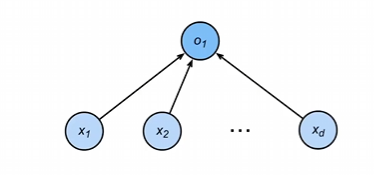
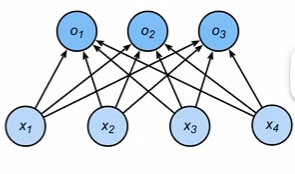

1. 回归估计一个连续的值
2. 分类估计一个离散的值
- **回归**
    - 单连续数值输出 
    - 自然区间$\mathbb{R}$
    - 跟真实值的区别作为损失
    
- **分类**
    - 通常多个输出
    - 输出i是预测为类别i的置信度
    

- **从回归到类别的过度**
    - 对类别进行一位有效编码
    $$\mathbf{y} = [y_1, y_2, \dots, y_n]^\top$$
    $$y_i = \begin{cases} 1 & \text{if } i = y \\0 & \text{otherwise}\end{cases}$$
    - 使用均方损失训练
    - 最大值最为预测
    $$\hat{y} = \underset{i}{\mathrm{argmax}} \ o_i$$
- **从回归到多类分类--无效验比例**
    - 对类别进行一位有效编码
    - 最大值最为预测
    $$\hat{y} = \underset{i}{\mathrm{argmax}} \ o_i$$
    - 需要更置信的识别正确类（大余量）
    $$o_y - o_i \geq \Delta(y, i)$$
- **从回归到多类分类--效验比例**
    - 输出匹配概率（非负，和为1）
    $\begin{align}
\hat{\mathbf{y}} &= \mathrm{softmax}(\mathbf{o}) \\
\hat{y}_i &= \frac{\exp(o_i)}{\sum_k \exp(o_k)}
\end{align}$
    - 概率 $\hat{y}_i$和$y_i$ 的区别作为损失

- Soft和交叉熵损失 
    ***一般使用交叉熵来衡量两个概率的区别***
    - 交叉熵常用来衡量两个概率的区别
    $$H(\mathbf{p}, \mathbf{q}) = \sum_i - p_i \log(q_i)$$
    - 交叉熵损失
    $$l(\mathbf{y}, \hat{\mathbf{y}}) = -\sum_i y_i \log \hat{y}_i = -\log \hat{y}_y$$
    - 其梯度是真实概率和预测概率的区别
    $$\partial_{o_i} l(\mathbf{y}, \hat{\mathbf{y}}) = \mathrm{softmax}(\mathbf{o})_i - y_i$$
- 总结
    - Softmax 回归是一个多类分类模型
    - 使用 Softmax 操作子得到每个类的预测置信度
    - 使用交叉熵来衡量预测和标号的区别
- 思考
    - 最初想法：把类别变成数字，比如猫 = 1，狗 = 2，鸟 = 3然后用回归去预测。
    但有问题：类别不是数字，不能比大小，不能加减。所以就要使用one-hot 编码，用均方误差训练，谁的输出最大，谁就越准确。
    - 改进：不只要正确类别最大，还要大出一个安全边界，不然模型很容易判断错。所以就有了oy - oi ≥ 边界的想法。
    - 最后使用Softmax回归 做两件重要的事情：
        - 把任意输出 → 变成概率（0~1 之间，总和 = 1）
        - 概率越大，代表越相信是这个类
    - 最后配合交叉熵使用，这里不使用均方误差，是因为在概率的时候，交叉熵是效果最好的
        - 交叉熵越小越好，模型的概率就越接近1
        - 交叉熵可以看作一个惩罚函数
            - 你预测对得越自信（概率→1），我惩罚越小
            - 你预测越不自信、越错（概率→0），我惩罚越大
        - 最终目的就是：不断惩罚模型 → 逼它把正确类的概率调到接近 1！

