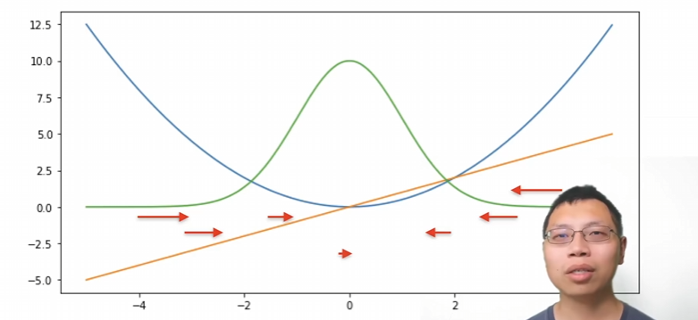
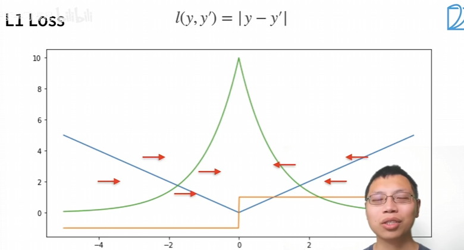
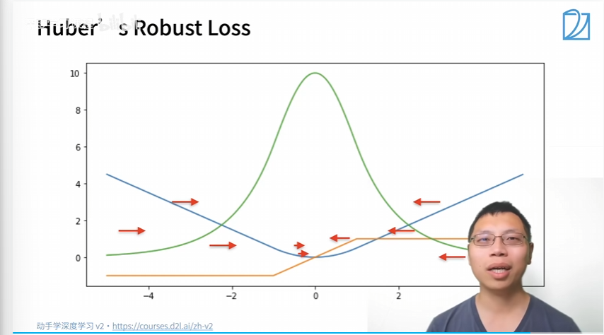

# 损失函数---3个类型
1. 均方损失函数（L2 Loss）MSE Loss
    $$L(y, \hat{y}) = \frac{1}{n} \sum_{i=1}^{n} (y_i - \hat{y}_i)^2$$
    - 
        - 蓝色曲线：L2 Loss 损失函数本身
        - 绿色曲线：L2 Loss 的似然函数
        - 橙色直线：L2 Loss 的梯度（导数）
    - 当预测值和真实值差距大的时候，会有更大的梯度拉向中间，当预测值和真实值差距小的时候，梯度会变小，趋近于0。
    - 缺点：有时候差距大的时候，不一定需要太大的梯度来更新参数
- ***所以有了L1 Loss函数***
2. 绝对值损失函数（L1 Loss）MAE Loss
    $$L(y, \hat{y}) = \frac{1}{n} \sum_{i=1}^{n} |y_i - \hat{y}_i|$$
    - 
        - 蓝色曲线：L1 Loss 损失函数本身
        - 绿色曲线：L1 Loss 的似然函数
        - 橙色直线：L1 Loss 的梯度（导数）
    - 当预测值和真实值差距大的时候，梯度是一个常数，不会随着差距的增大而增大。
    - 当预测值和真实值差距小的时候，梯度也是一个常数，不会趋近于0。
    - 优点：对于异常值不敏感，因为它的梯度是一个常数，不会因为差距的增大而增大。一直都是同样的‘力度’往原点扯。
    - 缺点：0点不可导。
- ***结合两个函数的优点，所以有Huber's Robust Loss***
3. Huber's Robust Loss 函数
    $$l(y, y') = 
    \begin{cases} 
    |y - y'| - \dfrac{1}{2} & \text{if } |y - y'| > 1 \\
    \dfrac{1}{2}(y - y')^2 & \text{otherwise}
    \end{cases}$$
    - 
        - 蓝色曲线：Huber's Robust Loss 损失函数本身
        - 绿色曲线：Huber's Robust Loss 的似然函数
        - 橙色直线：Huber's Robust Loss 的梯度（导数）
    - 特点：
        - 当预测值和真实值比较近的时候，是平滑的曲线。
        - 当预测值和真实值差值绝对值大于1的时候，会以一个稳定的‘力度’（梯度）拉向原点。
        - 当预测值和真实值差值绝对值小于等于1的时候，就会逐渐缩小‘力度’（梯度）拉向原点。达到平滑的效果。
- 思考：
    - 第一个均方误差函数，特点就是当预测值和真实值差距大的时候，会有更大的梯度拉向中间，当预测值和真实值差距小的时候，梯度会变小，趋近于0。但是有时候差距大的时候，不一定需要太大的梯度来更新参数。
    - 第二个是绝对值损失函数，无论预测值和真实值的差距大小，都会以一个稳定的梯度拉向原点。
    - 第三个是Huber's Robust Loss函数，融合和前两个损失函数的优点，差距大就用一个稳定的梯度拉向远点，差距小就逐渐减小梯度来更新参数，达到平滑的效果。
    - 选取损失函数的原则：
        - 如果数据中有很多异常值，建议使用L1 Loss或者Huber's Robust Loss函数。
        - 如果数据中没有异常值，建议使用L2 Loss函数。
    - 3个图的绿色曲线是似然函数$e^{-l}$，都类似于高斯分布。