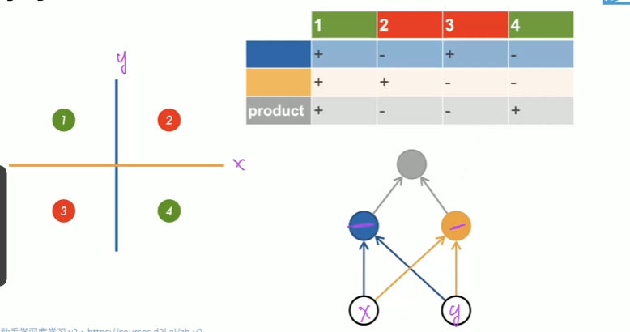
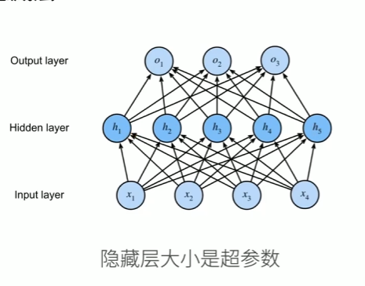
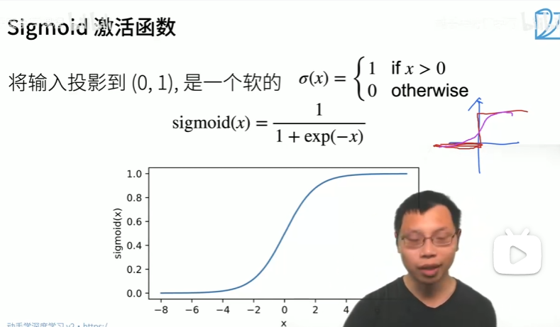
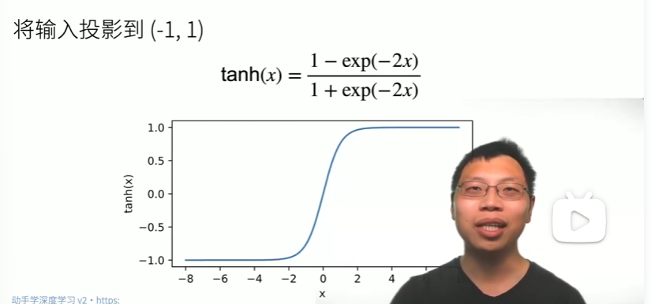
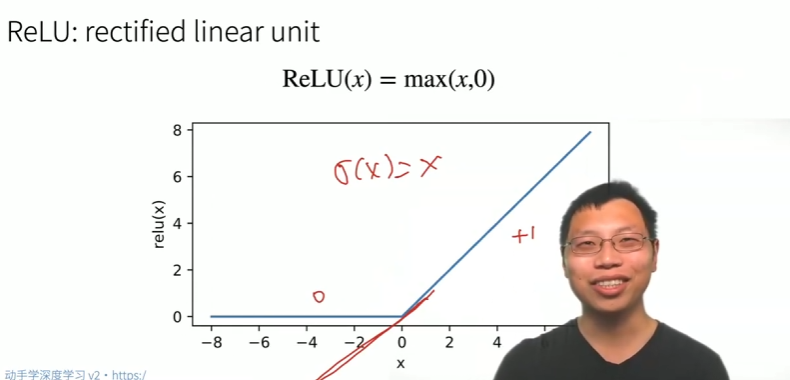
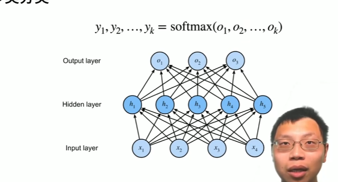
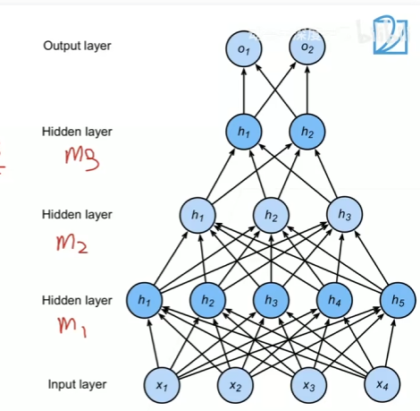

# 多层感知机
***还是从XOR进行入手***

- 这里x的上面为正，下面为负
- y的左边为正，右边为负
- 最后的product就是相乘
## 单隐藏层

- 隐藏层的大小就是超参数

## 单隐藏层--单分类
- 输入 $\mathbf{x} \in \mathbb{R}^n$
- 隐藏层 $\mathbf{W}_1 \in \mathbb{R}^{m \times n}, \mathbf{b}_1 \in \mathbb{R}^m$
- 输出层 $\mathbf{w}_2 \in \mathbb{R}^m, b_2 \in \mathbb{R}$
$$\begin{aligned}
\mathbf{h} &= \sigma(\mathbf{W}_1 \mathbf{x} + \mathbf{b}_1) \\
o &= \mathbf{w}_2^T \mathbf{h} + b_2
\end{aligned}$$
$\sigma$ 是按元素的激活函数 

***为什么需要非线性的激活函数***
$$
\begin{aligned}
\mathbf{h} &= \mathbf{W}_1 \mathbf{x} + \mathbf{b}_1 \\
o &= \mathbf{w}_2^\mathrm{T} \mathbf{h} + b_2 \\
\text{hence} \quad o &= \mathbf{w}_2^\mathrm{T} \mathbf{W}_1 \mathbf{x} + b'
\end{aligned}
$$
- 这是一个反面例子，进行了计算，发现最后还是有线性，这就和单层感知机没有区别了，就解决不了XOR问题例如。
- 即使多个线性层堆叠，等价于一个线性变换，无法学习复杂模式
### 激活函数
- Sigmoid激活函数
    
    - 如果只是0和1的话，在0处就垂直上升，不好求导。所以就拉弯了。
- Tanh激活函数
        
- ReLU激活函数
    - ReLU:rectifued liner unit
    - ***是最常用的激活函数***
    - 优点就是计算简单，不需要像前面两个要计算指数函数，还有缓解梯度消失。一次的指数计算在CPU中等价于计算100次乘法。
    
    
## 单隐藏层--多类分类

- 和softmax回归的区别不大，就是在中间加了一层隐藏层
- 输入 $\mathbf{x} \in \mathbb{R}^n$
- 隐藏层 $\mathbf{W}_1 \in \mathbb{R}^{m \times n}, \mathbf{b}_1 \in \mathbb{R}^m$
- 输出层 $\mathbf{W}_2 \in \mathbb{R}^{k \times k}, \mathbf{b}_2 \in \mathbb{R}^k$
$$
\mathbf{h} = \sigma(\mathbf{W}_1 \mathbf{x} + \mathbf{b}_1)
$$
$$
\mathbf{o} = \mathbf{W}_2^T \mathbf{h} + \mathbf{b}_2
$$
$$
\mathbf{y} = \text{softmax}(\mathbf{o})
$$
- 和上面的区别就是输出层多了k，维度更高。

## 多隐藏层
$$
\begin{aligned}
\mathbf{h}_1 &= \sigma(\mathbf{W}_1 \mathbf{x} + \mathbf{b}_1) \\
\mathbf{h}_2 &= \sigma(\mathbf{W}_2 \mathbf{h}_1 + \mathbf{b}_2) \\
\mathbf{h}_3 &= \sigma(\mathbf{W}_3 \mathbf{h}_2 + \mathbf{b}_3) \\
\mathbf{o} &= \mathbf{W}_4 \mathbf{h}_3 + \mathbf{b}_4
\end{aligned}
$$
- 超参数
    - 隐藏层数
    - 每层隐藏层的大小
- 过程就是，一层一层的压缩
    -  比如输入的是128维，下一次就是64，再下一次32，一点一点的压缩，不能一下子压缩太多，因为会损失很多数据。
    
    - 都是一点一点压缩，图片是先放大一点才就绪压缩。
    - 比如在第一次就压缩到2，再扩大到64的话，在压缩为2的过程已经损失了很多很多的数据。
    - 更加严谨的说法是通过“隐藏层逐步提取高层次特征”或“降维与升维”

# 总结
- 多层感知机使用隐藏层和激活函数来得到非线性模型。
- 常用激活函数有Sigmoid,Tanh,ReLU
- 使用Softmax来处理多分类
- 超参数为隐藏层数，和各个隐藏层大小。
# 思考
- 激活函数一般使用ReLU函数（没有其他特殊想法的话）
- 对超参数的隐藏层不是也大越好，少了会损失重要数据，多了就会导致过拟合且训练也特别的难。
- 多层感知机（MCP）虽然基础，却是理解深度学习模型的必备基石，要易到难。