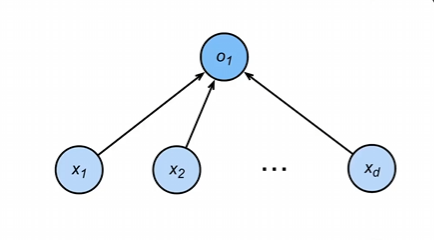
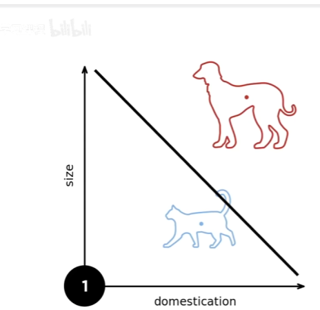
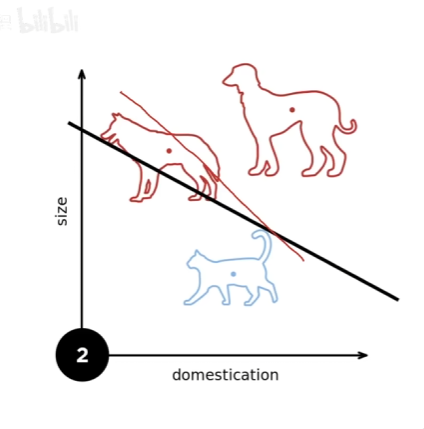
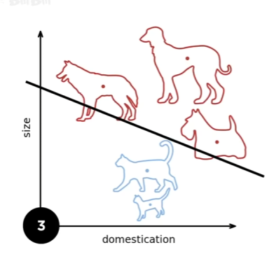
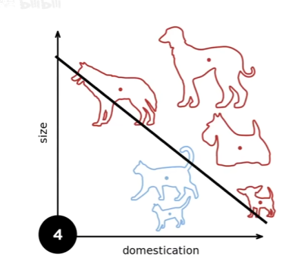
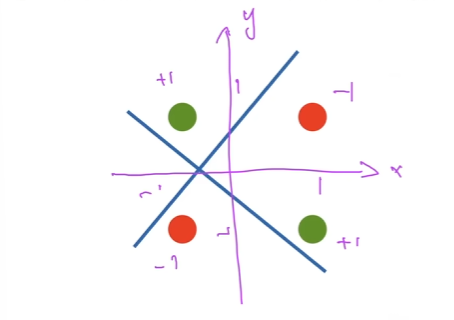

1. 感知机
    - 给定输入x,权重w,和偏移b，感知机输出：
    $$
    o = \sigma\left( \langle \mathbf{w}, \mathbf{x} \rangle + b \right)
    $$
    $$
    \sigma(x) =
    \begin{cases}
    1 & \text{if } x > 0 \\
    0 & \text{otherwise}
    \end{cases}
    $$
    
    - 二分类：-1或1
        - 回归输出实数
        - softmax 回归输出概率
2. 训练感知机
    $$
    \begin{align*}
    &\text{initialize } w = 0 \text{ and } b = 0 \\
    &\text{repeat} \\
    &\quad \text{if } y_i \left[ \langle w, x_i \rangle + b \right] \leq 0 \text{ then} \\
    &\quad \quad w \leftarrow w + y_i x_i \text{ and } b \leftarrow b + y_i \\
    &\quad \text{end if} \\
    &\text{until all classified correctly}
    \end{align*}
    $$
    - 只要满足$y_i \left[ \langle w, x_i \rangle + b \right] \leq 0$就说明不符合条件
        - 前者为1，那后者就是小于等于0；前者为-1，那后者就大于0。
    - 等价于使用批量大小为1的梯度下降，并使用如下的损失函数
    $$\ell(y, \mathbf{x}, \mathbf{w}) = \max\left(0, -y \langle \mathbf{w}, \mathbf{x} \rangle\right)$$
    - 这里的max对应的是上面伪代码的if条件
3. 例子
    - 对猫和狗进行分类
    - 中间一条线进行分割。
    
    - 再来一只狗，分割线就会往下推一点。
    
    - 再来一只，继续下推
    
    
    - ***总的来说，就是上面的样本数量多了，分割线就会往下推一点，下面的样本多了，分割线就会往上推，目的都是为了提高分类的准确率。***
4. 收敛定理
    - 数据再半径r内。（r和数据的样本大小有关）
    - 余量ρ分类两类
    $$
    y(\mathbf{x}^\mathrm{T}\mathbf{w} + b) \ge \rho
    $$

    对于
    $
    \|\mathbf{w}\|^2 + b^2 \le 1
    $
    感知机保证在 $\dfrac{r^2 + 1}{\rho^2}$ 步后收敛。收敛还是很取决于r也就是样本的大小的。
5. 感知机存在的问题
    - 不能拟合***XOR***问题，只能产生线性分割面。
    
    在一三象限为一类，在二四象限为一类。

# 总结
- 感知机是一个二分类模型，是最早的AI模型之一。
- 它的求解算法等价于使用批量大小为1的梯度下降。
- 它不能拟合XOR函数，导致了第一次的AI寒冬。
# 思考
- 感知机后续10年至15年，有了多层感知机来解决XOR函数
- 感知机是简单的一个模型，为后续的多层感知机做出了铺垫。
- 直接启发了多层感知机MLP、SVM、核方法。