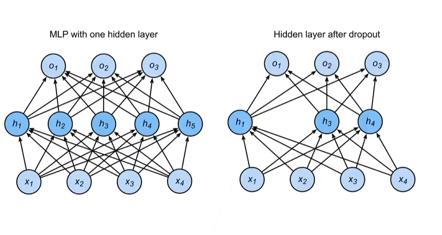

# 丢弃法

## 动机
- 一个好的模型要对输入的数据具有鲁棒性，不能过于依赖输入的某些特征。
    - 使用有噪音的数据等价于Tikhonov正则化。
    - 丢弃法：在层之间添加噪音
    - 所以有个隐藏的意思就是丢弃法是一个正则化方法。

## 无偏差的加入噪音
- 对x加入噪音得到$x'$,我么希望：
    $$\mathbb{E}[x'] = x$$
- 例如：丢弃法
    - 以概率p丢弃输入的每个元素。
    - 以概率1-p保留输入的每个元素，并将其值除以1-p。
    - 这样做的原因是为了保持输入的期望值不变。
    $$x_i' = 
    \begin{cases} 
    0 & \text{with probability } p \\
    \dfrac{x_i}{1 - p} & \text{otherwise}
    \end{cases}$$
    - 计算期望值（证明期望不变和除以1-p的目的）：
    $$\begin{align*}
    \mathbb{E}[x_i'] &= p \cdot 0 + (1-p) \cdot \frac{x_i}{1-p} \\
    &= 0 + x_i \\
    &= x_i
    \end{align*}$$

## 使用丢弃法
- 通常将丢弃法作用在隐藏全连接层的输出上。

$$\begin{align*}
\mathbf{h} &= \sigma(\mathbf{W}_1 \mathbf{x} + \mathbf{b}_1) \\
\mathbf{h}' &= \text{dropout}(\mathbf{h}) \\
\mathbf{o} &= \mathbf{W}_2 \mathbf{h}' + \mathbf{b}_2 \\
\mathbf{y} &= \text{softmax}(\mathbf{o})
\end{align*}$$
- 公式就是先计算隐藏层的输出$\mathbf{h}$，然后对$\mathbf{h}$应用丢弃法得到$\mathbf{h}'$，最后使用$\mathbf{h}'$计算输出$\mathbf{o}$并通过softmax得到最终的预测$\mathbf{y}$。
- 在训练过程中，丢弃法会随机丢弃一些神经元的
- 图中是丢弃了$\mathbf{h}_2$和$\mathbf{h}_5$，就变成了0，下一次就有可能丢弃其他的神经元。或者全部保留。

## 推理中的丢弃法
- 正则项只在训练过程中使用，在推理过程中不使用，因为它们影响的是模型的
- 在推理过程中，丢弃法直接返回输入，或者说不进行丢弃。
$$\mathbf{h} = \text{dropout}(\mathbf{h})$$
- 这样子可以保证确定性的输出。

## 总结
- 丢弃法将一些输出项随机置0来控制模型复杂度。
- 经常直接作用在多层感知机的隐藏层上。
- 丢弃概率是控制模型复杂度的超参数。
