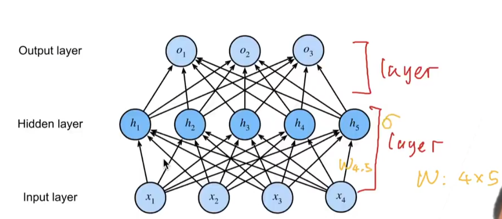
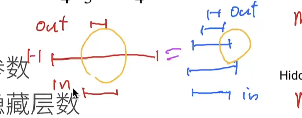

# 关于多层感知机的一些问题

1. ***请问神经网络中的一层网络到底是指什么?是一层神经元经过线性变换后称为一层网络，还是一层神经元经过线性变化加非线性变换后称为一层?***
    
    - 如图，就是箭头那里才有意义上的一层，通过了2层的计算输出结果。
    - 图中是将输入层合并了隐藏层，也可以将输出层进行合并。反正就是最终经过几次计算是看箭头的层数。
    - 一般来说一层是`权重`+`激活函数`+`计算`
2. ***请问老师为什么神经网络要增加隐藏层的层数，而不是神经元的个数?是不是有神经网络万有近似性质吗?***
    
    - 左边的是浅度学习；右边的是深度学习。这两个的模型复杂度是等价的。
    - 左边的模型不好训练，一下子变那么大，就是`打肿脸充胖子`,非常容易过拟合（OVERFIT）。
    - 右边的分多次，比如学习一个猫和狗，先学耳朵，然后头......就是一小步一小步学习，这样子的模型就好一点训练。
3. ***relu为什么管用，它在大于0的部分也就只是线性变换啊。为什么能促进学习呢，激活的本质是要做什么事?不是引入非线吗？***
    
    - 线性函数一定要满足`f(x)=ax+b`（编程中是，数学上不是）。而ReLU函数虽然是一根线，但是不是线性函数。
    - ReLU是非线性的，所以可以当作激活函数，激活函数就是要引入非线性的东西。
4. ***模型的深度和宽度哪个更影响性能，有理论指导吗?就是加深哪个更有效。怎么根据输入空间，选择最优的深度或者宽度?***
    - 我们假设输入的是200维，输出的是8维。
    - 第一步我们可以不加隐藏层直接跑。
    - 第二步可以加一个单12的隐藏层，然后用32、64、128。
    - 第三步可以变成多层的，可以是32加16，一点一点的试。