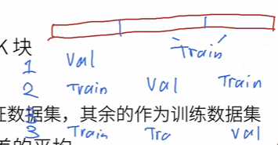

# 模型选择

## 背景
- 银行雇佣你来调查谁会偿还贷款
    - 有100个人的申请人的信息
    - 其中5个人3年内违约了
- 惊讶的发现
    - 这5个人在面试的时候都身穿的蓝色衬衫
    - 模型也发现了这个强的信号
    - 会有什么问题？
        - 如果第一次面试穿了蓝色的衬衫，如果下一次是红色的衬衫，那就是不一样的人吗？当然不是，但是模型并不会知道这个因素，所以这回有一个弊端。

## 正题
### 训练误差和泛化误差
- 训练误差：模型在训练数据上的误差。
- 泛化误差：模型在新数据上的误差。
- 例子：根据模考成绩来预测未来考试分数
    - 在过去的考试中表现的很好（训练误差）不代表在未来的考试一定会好（泛化误差）。
    - 学生A通过背书在模考取得好成绩。（背答案）
    - 学生B知道答案。（老师在课上讲过）
    - **最后在全新的题目中取得的成绩是不能被预测的。**

### 验证数据集和测试数据集
- 验证数据集：一个用来评估模型的好坏的数据集。
    - 例如拿出50%的数据集
    - 不要和训练数据混在一起（常犯错误）
    - 混在一起了就会误以为模型的评估等级很高
- 测试数据集：只能使用一次的数据集，一个用来评估模型的好坏的数据集。
    - 未来的考试
    - 我出价的房子的实际成交价格
    - 用在kaggale私有排行榜的数据集
    - 不能用来调参，否则就会过拟合测试数据集了

### K-折交叉验证（在数据集很少的时候使用）
- 在没有足够多的数据时使用（这是常态）
- 算法
    - 将训练集分割为K块
    - 迭代K次，每次使用其中一块作为验证集，剩余的K-1块作为训练集
    - 计算K次的验证误差的平均值，作为模型的评估指标
    
- 优点
    - 更有效地利用数据，尤其是在数据量有限的情况下
- 常用的K=5或K=10

### 总结
- 训练数据集：训练模型参数
- 验证数据集：选择模型的超参数
- 非大数据集上通常使用K-折交叉验证

### 思考
- 用训练数据来训练模型，然后再使用验证数据集来自己评估模型的好坏，继续调参数，最后再使用测试数据集最终来给模型定级打分。
- 测试数据集只能使用一次，如果使用了两次，就会过拟合测试数据集了；验证数据集可以使用多次来调参。