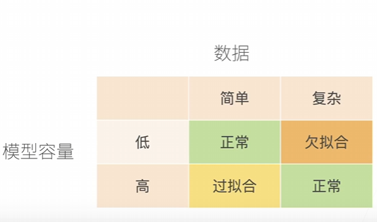
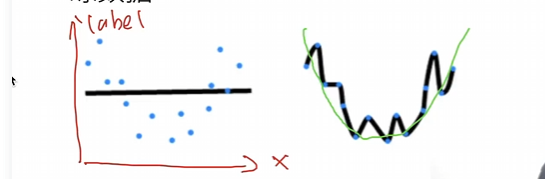
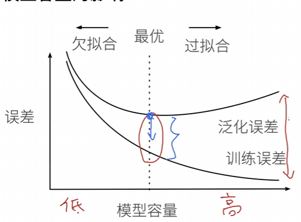
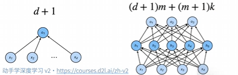

# 过拟合和欠拟合

## 过拟合欠拟合的概念

- 数据简单就要选择简单的模型
- 数据复杂就要选择复杂的模型
- 要不然就会过拟合了（模型太复杂了，训练数据的噪声也被学到了）或者欠拟合了（模型太简单了，训练数据的规律没有学到）

## 模型容量的定义
- 拟合各种函数的能力
- 低容量的模型难以拟合训练数据
- 高容量的模型可以记住所有的训练数据

- 图中的点是训练数据，黑线是模型的容量

## 模型容量的影响

- 模型低的时候，训练误差就会高，学习不了数据的规律，泛化误差也会高。
- 模型高的时候，训练误差就会低，学习了数据的规律，泛化误差也会高。
- 模型适中的时候，训练误差就会适中，学习了数据的规律，泛化误差也会适中。
- 训练误差和泛化误差之间的gap是衡量过拟合程度的一个指标，gap越大，过拟合程度越高。
- 过拟合本身不是一个不好的东西，有时候为了让模型更好，就要牺牲一点过拟合，就是要接受过拟合一点。

## 估计模型容量
- 难以比较不同种类算法之间比较
    - 例如树模型和神经网络
- 给定一个模型种类，将有两个主要因数
    - 参数的个数
    - 参数值的选择范围

## VC维
- 统计学习理论的一个核心思想
- 对于一个分类模型，VC等于一个最大的数据集大小，不管如何给定标号，都存在一个模型来对它进行完美分类。

## 线性分类器的VC维
- 2维输入的感知机，VC维是3
    - 能够分类任何三个点，但不能分类任何四个点（xor）
    - 不能是异或问题（那个弯曲的曲线）

- 支持N维输入的感知机的VC维是N+1
- 一些多层感知机的VC维是指数级的O(NlogN)

## VC维的好处
- 提供为什么一个模型好的理论依据
    - 它可以衡量训练误差和泛化误差之间的gap
- 但是在深度学习很少使用
    - 衡量不是很准确
    - 计算深度学习模型的VC维是非常困难的

## 数据复杂度的定义
- 有多个样本主要因素
    - 样本个数
    - 每个样本的元素个数
    - 时间、空间结构
    - 多样性

## 总结
- 模型容量需要匹配数据复杂度，否者可能会过拟合或者欠拟合
- 统计机器学习提供数学工具来衡量模型复杂度
- 实际中一般靠观察训练误差和验证误差